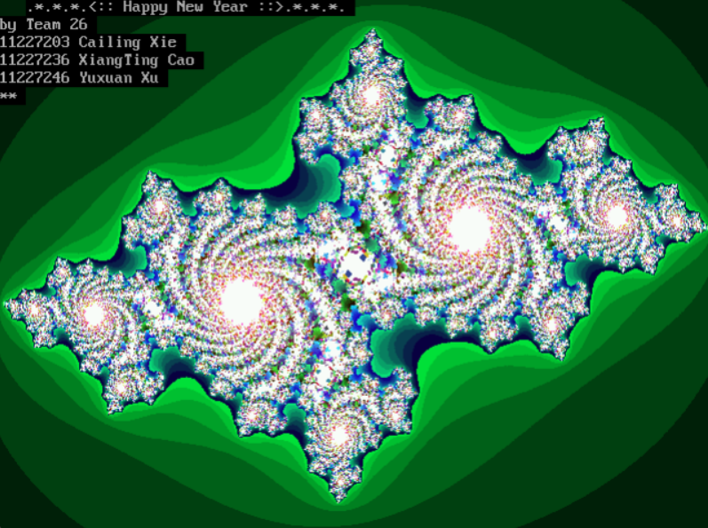
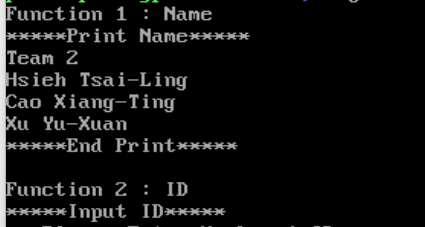
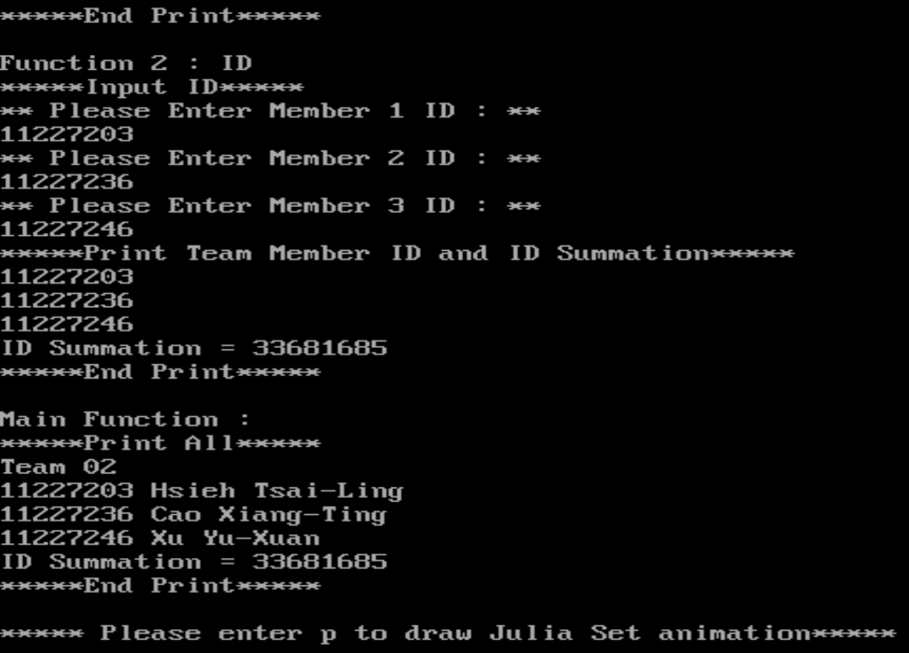
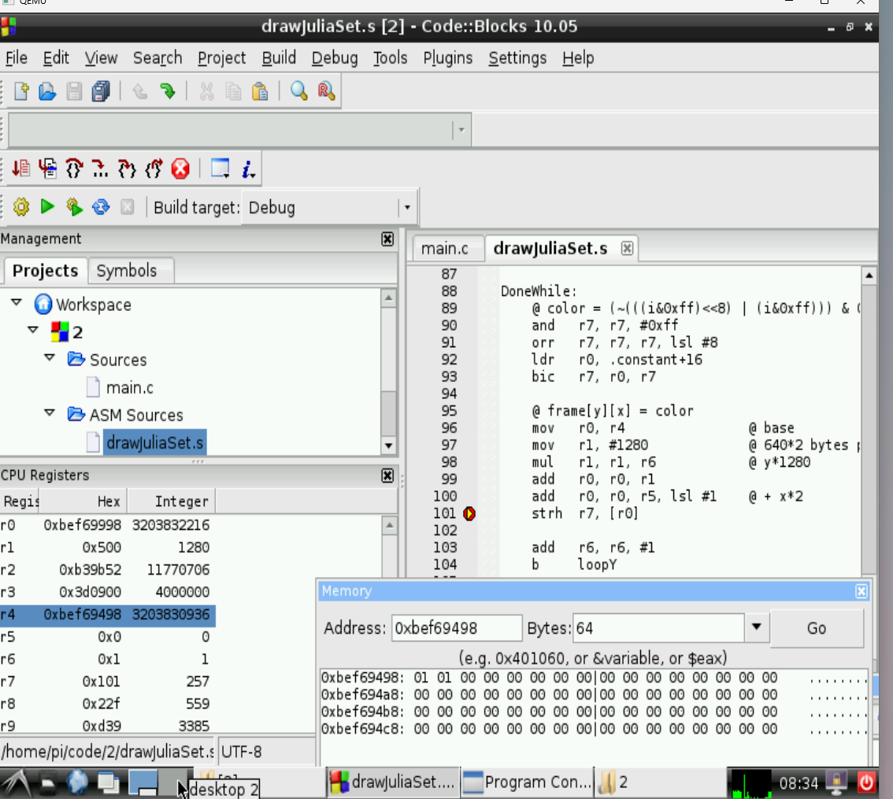
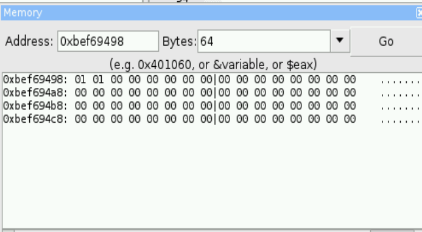

# ARM 組合語言期末專題：Julia Set 動畫

這是「組合語言與嵌入式系統」課程的期末專題。我們使用 C 語言搭配 ARM 組合語言，完成組員資訊顯示、學號輸入與加總，以及 Julia Set 分形動畫。

主程式由 `main.c` 串接各個組合語言模組，最後將計算好的影像寫入 Linux framebuffer，顯示 Julia Set 隨參數變化的圖形。

## 成果展示



圖：報告中的 Julia Set 執行結果，畫面顯示分形圖形及動畫完成後的組員資訊。

## 課程與組員

- 課程：組合語言與嵌入式系統
- 學期：113 學年度第 1 學期
- 授課老師：朱守禮老師
- 組別：第二組

| 學號 | 姓名 |
| --- | --- |
| 11227203 | 謝采凌 |
| 11227236 | 曹湘婷 |
| 11227246 | 徐雨瑄 |

### 組員分工

| 組員 | 負責項目 |
| --- | --- |
| 謝采凌 | `name.s` 的設計與實作，協助 `main.c` 整合與功能測試 |
| 曹湘婷 | `id.s` 的設計與實作 |
| 徐雨瑄 | `drawJuliaSet.s` 的設計與實作 |

## 功能介紹

| 功能 | 說明 |
| --- | --- |
| 顯示組員資訊 | 印出組別與三位組員的姓名 |
| 輸入與加總學號 | 輸入三位組員的學號，計算總和並回傳主程式 |
| 繪製 Julia Set | 使用 ARM 組合語言計算每個像素的顏色 |
| 播放分形動畫 | 改變 Julia Set 的參數，將連續影像寫入 `/dev/fb0` |

## 檔案說明

| 檔案 | 內容 |
| --- | --- |
| `main.c` | 主程式，負責函式呼叫、輸入流程與 framebuffer 輸出 |
| `name.s` | 顯示組別及組員姓名 |
| `id.s` | 讀取學號、計算總和，透過指標寫回主程式的變數 |
| `drawJuliaSet.s` | Julia Set 的座標轉換、迭代運算與像素寫入 |
| `julia` | 已編譯的執行檔 |
| `組合語言與嵌入式系統Final Project.pdf` | 專題報告，包含程式說明、設計重點與驗證結果 |

## 程式流程

1. 呼叫 `name()`，顯示組員姓名。
2. 呼叫 `id()`，讓使用者輸入三個學號，計算學號總和。
3. 主程式印出學號、姓名與總和。
4. 輸入 `p` 並按 Enter，開始繪製 Julia Set 動畫。
5. 固定 `cX = -700`，將 `cY` 從 `400` 每次減少 `5`，直到 `270`，共產生 27 張影像。
6. 動畫完成後顯示祝福文字與組員資訊，再輸入 `p` 並按 Enter 結束。

## 執行結果與驗證

### 組員姓名輸出



呼叫 `name()` 後，印出第二組與三位組員姓名。

### 學號輸入與加總



輸入三位組員學號後，`id()` 計算總和 `33681685`，主程式再將學號與姓名一起印出。

### 影像緩衝區驗證



使用 Code::Blocks 的除錯功能，檢查繪圖函式執行時的暫存器與影像緩衝區。



報告中的記憶體檢查顯示，`frame` 起始位址為 `0xbef69498`。每個像素占 2 bytes，每列占 1280 bytes，完整影像共占 614,400 bytes；第一個像素的內容為 `01 01`。此位址是該次除錯結果，執行時可能不同。

## Julia Set 怎麼畫出來？

Julia Set 的基本運算是：

```text
z = z² + c
```

程式先把 640 × 480 畫面上的每個像素，轉換成複數平面上的座標，再重複計算。當數值超過設定的範圍，或最多 255 次迭代用完時，就停止計算，並依剩餘迭代次數決定像素顏色。

這份實作使用整數縮放表示座標，透過 `__aeabi_idiv` 完成整數除法，最後以 `strh` 將 16-bit 顏色值寫入 `frame[y][x]`。改變參數 `cY` 後，圖形也會跟著變化，形成動畫。

## 實作重點

- **C 與組合語言整合**：由 C 主程式呼叫 ARM 函式，完成不同模組之間的資料傳遞。
- **指標與記憶體存取**：`id.s` 接收變數位址，將輸入的學號及總和寫回 C 程式。
- **暫存器與堆疊管理**：保存函式使用的暫存器與返回位址；繪圖函式從堆疊取出第五個參數 `frame`。
- **迴圈與條件判斷**：使用分支指令實作像素掃描與 Julia Set 迭代。
- **移位與條件執行指令**：程式中包含 `LSL`、`LSR`、`ASR`、`ROR`，以及 `movle`、`addne`、`eorpl` 等課程要求的指令。

## 編譯與執行

### 執行環境

老師的作業說明使用 GCC、GAS 與 Code::Blocks，並在課程提供的樹莓派模擬器中驗證。程式使用 32-bit ARM 組合語言，需要相容的 ARM Linux 環境與 GCC。動畫會直接寫入 `/dev/fb0`，因此執行環境也需要可存取的 framebuffer。

目前繪圖程式固定使用 640 × 480、每像素 16-bit 的影像資料，framebuffer 的解析度、像素格式與每列位元組數需與此配置相容。一般 Windows 終端機或沒有 framebuffer 的環境，無法直接顯示這個動畫。

### 在相容的 ARM Linux 環境編譯

```bash
gcc -o julia main.c name.s id.s drawJuliaSet.s
./julia
```

以上為依原始碼整理的編譯方式，實際編譯選項需依課程使用的 ARM 工具鏈調整。執行時請確認目前帳號有讀寫 `/dev/fb0` 的權限。

若出現 `Frame Buffer Device Open Error!!`，表示程式無法開啟 framebuffer，請確認裝置是否存在及權限是否正確。

### 學號輸入範例

依提示分別輸入三位組員的學號：

```text
11227203
11227236
11227246
```

加總結果為：

```text
ID Summation = 33681685
```

## 學習收穫

這次專題讓我把課堂上學到的暫存器、堆疊、分支與記憶體存取，實際用在一個完整的程式中。透過 C 與 ARM 組合語言的整合，也更清楚函式之間如何傳遞參數，以及計算結果如何寫回記憶體並顯示在畫面上。

## 專題報告

[查看期末專題報告](組合語言與嵌入式系統Final%20Project.pdf)

[查看 GitHub 原始碼](https://github.com/shanny11shanny14-sys/Assembly-Language-Final)
